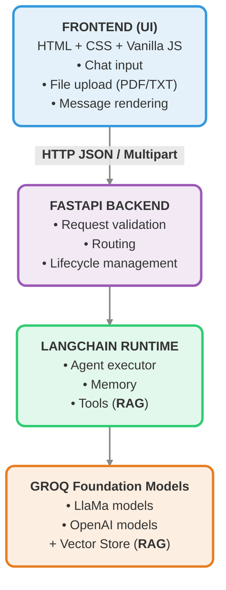
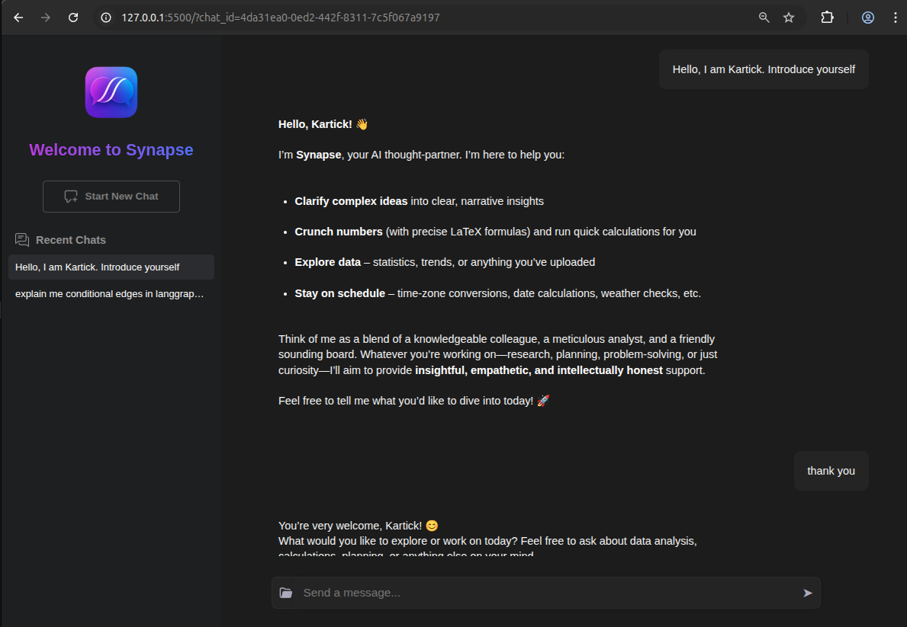
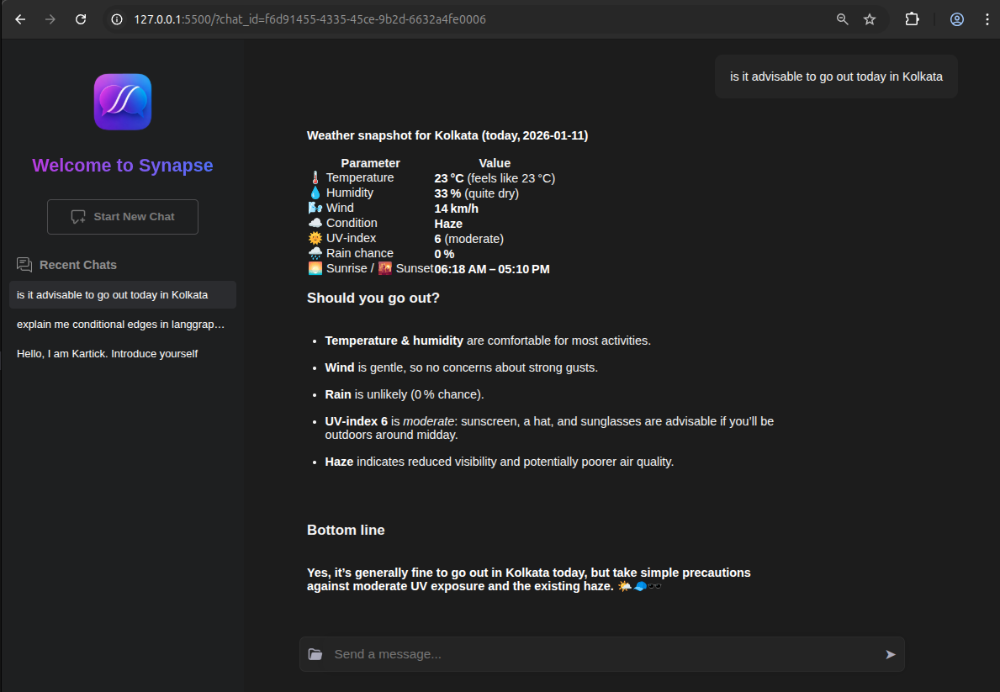
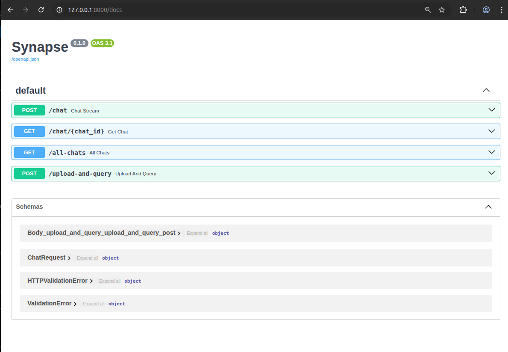

#  Synapse

Synapse is a **minimal agentic GenAI chat application** built to demonstrate practical understanding of **LangChain**, **LLM agents**, and **RAG (Retrieval-Augmented Generation)**, served via **FastAPI** with a lightweight vanilla JS frontend.

The project intentionally prioritizes **clarity, modularity, and explainability** over production-scale complexity.

## ✨ Key Features

- 🤖 **Agentic LLM Chat**
  - Built using LangChain’s `create_agent`
  - Powered by Groq-hosted foundation models. Eg. `llama-3.1-8b-instant`, `openai/gpt-oss-20b`
  - Supports short-term conversational memory within a chat

- 📄 **RAG (Retrieval-Augmented Generation)**
  - Upload **PDF or TXT** documents
  - Agent can retrieve relevant context from uploaded documents
  - Works seamlessly alongside normal LLM chat

- 🧠 **Conversational Memory**
  - Agent remembers recent messages in the same chat
  - Memory is scoped to a single user multi-chat session (with persistence as well)

- 🧩 **Modular Architecture**
  - Clean separation between API layer, Agent logic, Tools, and Orchestration
  - Designed to be easily extended (auth, multi-user, LangGraph)

- 🌐 **Minimal Frontend**
  - Vanilla HTML, CSS, and JavaScript
  - Simple chat interface for demonstration and testing

## 🎯 Purpose of This Project

Synapse exists to demonstrate:

- Agent-based GenAI application design
- Practical LangChain usage
- Clean backend architecture
- Thoughtful engineering tradeoffs

It is intentionally minimal, modular, and extensible.

## 🏗️ Architecture Overview

## 🧠 How RAG Works in Synapse

1. User uploads a PDF or TXT file
2. Document is loaded and split into chunks
3. Chunks are embedded and stored in an in-memory vector store
4. RAG is exposed to the agent as a **tool**
5. During chat:
   - Agent decides whether to call the RAG tool
   - Retrieved context is injected into the reasoning process
   - Final answer is generated by the LLM

If no document is uploaded, the agent behaves like a normal conversational LLM.

## 💾 Memory Model

- Short-term, thread-safe in-process memory
- Maintains recent conversation turns
- Scoped to single user multi chat management simultaneously
- Persistence across restarts

This design keeps behavior predictable while remaining extensible to:

- LangGraph checkpoints
- Multi-user isolation (future scope)

## 🚫 Out of Scope (Intentional)

- Authentication & authorization
- Multi-user support
- Advanced UI frameworks (Like. React or Angular)

These are intentionally excluded to keep the project focused and explainable.

## 🔮 Future Extensions

- Multi-user support with authentication
- System Controlled Adaptive RAG Implementation
- LangGraph-based orchestration
- Replacing Streaming responses using SSE (Server Sent Events)
- Tool expansion (web search, sandboxed code execution, etc.)

## ▶️ Running the Application (Local)

1. Clone the repository
2. Create a virtual environment: `virtualenv .pyenv`
3. Activate the virtual environment:
    - On Windows: `.pyenv/scripts/activate`
    - On Linux/Mac: `source .pyenv/bin/activate`
4. Install dependencies: `pip install -r requirements.txt`
5. Create a `.env` file in the root project folder.
   - Add Groq API key to `.env` as `GROQ_API_KEY`=`...`
   - Optionally, You can add these LangSmith Tracing parameters as well:

      - `LANGCHAIN_TRACING_V2`=`true`
      - `LANGCHAIN_ENDPOINT`=`https://api.smith.langchain.com`
      - `LANGCHAIN_API_KEY`=`...`
      - `LANGCHAIN_PROJECT`=`synapse`
6. Start the FastAPI server
    - Open a Terminal and run this command: `uvicorn app.main:app --reload`
7. Open another Terminal and start the Frontend server using Python http:
   - Go to `frontend` folder: `cd frontend`
   - Run `python -m http.server 5500`

8. Open the frontend in a browser and navigate to: `http://127.0.0.1:5500`
9. OR You can test the FastAPI endspoints on: `http://127.0.0.1:8000/docs`

---

## 🖼️ Example Screenshots

- Frontend UI Pages of the Synapse Application
  
  

- Chat Screenshots
  
  
  
  

- FastAPI Endpoints

  