#  Synapse

Synapse is a **minimal agentic GenAI chat application** built to demonstrate practical understanding of **LangChain**, **LLM agents**, and **RAG (Retrieval-Augmented Generation)**, served via **FastAPI** with a lightweight vanilla JS frontend.

The project intentionally prioritizes **clarity, modularity, and explainability** over production-scale complexity.

## ✨ Key Features

- 🤖 **Agentic LLM Chat**
  - Built using LangChain’s `create_agent`
  - Powered by Groq-hosted foundation models. Eg. `llama-3.1-8b-instant`, `openai/gpt-oss-20b`
  - Supports short-term conversational memory within a chat

- 📄 **RAG (Retrieval-Augmented Generation)**
  - Upload **PDF or TXT** documents
  - Agent can retrieve relevant context from uploaded documents
  - Works seamlessly alongside normal LLM chat

- 🧠 **Conversational Memory**
  - Agent remembers recent messages in the same chat
  - Memory is scoped to a single session (no global persistence)

- 🧩 **Modular Architecture**
  - Clean separation between API layer, agent logic, tools, and infrastructure
  - Designed to be easily extended (auth, multi-user, persistence, LangGraph)

- 🌐 **Minimal Frontend**
  - Vanilla HTML, CSS, and JavaScript
  - Simple chat interface for demonstration and testing

## 🎯 Purpose of This Project

Synapse exists to demonstrate:

- Agent-based GenAI application design
- Practical LangChain usage
- Clean backend architecture
- Thoughtful engineering tradeoffs

It is intentionally minimal, modular, and extensible.

## 🏗️ Architecture Overview

``` mermaid
graph TD
    %% Node Definitions with Bold Titles
    A["<b>FRONTEND (UI)</b><br/>HTML + CSS + Vanilla JS<br/>• Chat input<br/>• File upload (PDF/TXT)<br/>• Message rendering"]
    
    B["<b>FASTAPI BACKEND</b><br/>• Request validation<br/>• Routing<br/>• Lifecycle management"]
    
    C["<b>LANGCHAIN RUNTIME</b><br/>• Agent executor<br/>• Memory<br/>• Tools (<b>RAG</b>)"]
    
    D["<b>GROQ Foundation Models</b><br/> • LlaMa models<br/> • OpenAI models <br/> + Vector Store (<b>RAG</b>)"]

    %% Flow Connections with bold labels
    A ==>|<b>&nbsp; HTTP JSON / Multipart &nbsp;</b>| B
    B ==> C
    C ==> D

    %% Styling for High Visibility
    %% Using high-contrast borders and semi-transparent fills 
    %% that work in both Light and Dark modes
    style A fill:#3498db22,stroke:#3498db,stroke-width:3px,rx:10,ry:10
    style B fill:#9b59b622,stroke:#9b59b6,stroke-width:3px,rx:10,ry:10
    style C fill:#2ecc7122,stroke:#2ecc71,stroke-width:3px,rx:10,ry:10
    style D fill:#e67e2222,stroke:#e67e22,stroke-width:3px,rx:10,ry:10

    %% Edge styling
    linkStyle default stroke:#888,stroke-width:2px
```

## 🧠 How RAG Works in Synapse

1. User uploads a PDF or TXT file
2. Document is loaded and split into chunks
3. Chunks are embedded and stored in an in-memory vector store
4. RAG is exposed to the agent as a **tool**
5. During chat:
   - Agent decides whether to call the RAG tool
   - Retrieved context is injected into the reasoning process
   - Final answer is generated by the LLM

If no document is uploaded, the agent behaves like a normal conversational LLM.

## 💾 Memory Model

- Short-term, in-process memory
- Maintains recent conversation turns
- Scoped to a single chat session
- No persistence across restarts

This design keeps behavior predictable while remaining extensible to:

- Redis / DB-backed memory
- LangGraph checkpoints
- Multi-user isolation (future scope)

## 🚫 Out of Scope (Intentional)

- Authentication & authorization
- Multi-user support
- Persistent storage
- Streaming responses
- Advanced UI frameworks

These are intentionally excluded to keep the project focused and explainable.

## ▶️ Running the Application (Local)

1. Clone the repository
2. Create a virtual environment
3. Install dependencies
4. Add Groq API key to `.env` as `GROQ_API_KEY`=`...`
5. Start the FastAPI server
6. Open the frontend in a browser

(Exact commands will be added once implementation is complete.)

---

## 🔮 Future Extensions

- Multi-user support with authentication
- Persistent memory using Redis or database
- LangGraph-based orchestration
- Streaming responses
- Tool expansion (web search, code execution, etc.)
